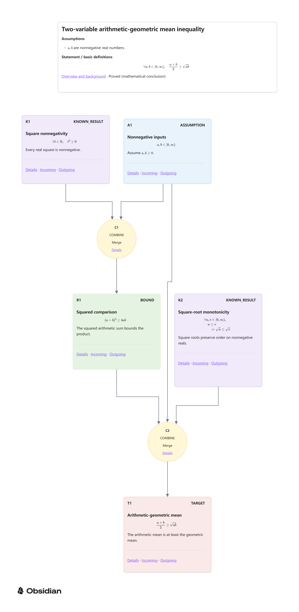

# Math Logic Mindmap

[English](../README.md) · [Français](README.fr.md) · [中文](README.zh-CN.md)

**从已知出发，理解每一步为何发生，让逻辑流向结论。**

## 1. 项目简介

Math Logic Mindmap 借助 Codex、Claude Code 等 AI 工具，**拆解数学定理证明或问题解答的逻辑**，再创建**证明逻辑流图**。工具遵循项目规范，先完成并自查数学论证，再梳理各步的依赖关系，最后生成 Obsidian Canvas 导图和相互链接的 Markdown 笔记；推荐使用 Obsidian 搭配 Advanced Canvas 阅读。

## 2. 快速开始

### ① 打开现成示例

1. 在[项目仓库](https://github.com/ShenglingZHU/math-logic-mindmap)选择 **Code → Download ZIP**，或下载指定 Release 的 **Source code** 压缩包以获取已发布版本。解压时保留隐藏目录。无需 Git；Python wheel 包不能替代完整仓库和示例。
2. 首次打开仓库前，从 [Advanced Canvas 7.0.0 发布页](https://github.com/Developer-Mike/obsidian-advanced-canvas/releases/tag/7.0.0)下载 `main.js`、`manifest.json`、`styles.css`，直接放入 `.obsidian/plugins/advanced-canvas/`，保留已有 `data.json`。Advanced Canvas 需另行安装，项目不分发它的程序文件。
3. 在桌面版 Obsidian 中将**项目根目录作为仓库（vault）打开**。若出现信任提示，请在信任项目及插件代码的前提下允许社区插件；否则在“设置 → 社区插件”中开启社区插件。社区插件拥有 Obsidian 的本机权限，启用前请检查 Proof Routing 的本地源码。
4. 确认 Canvas 核心插件、**Advanced Canvas 7.0.0**、**Proof Routing 0.6.1** 和“外观 → CSS 代码片段”中的 **math-logic-mindmap** 已启用。随附配置已选择这两个社区插件及片段；若未启用，再开启。打开[两变量均值不等式导图](../mindmap/two-variable-am-gm.canvas)，点击节点详情链接。

阅读现成示例**不需要 Python 或 AI 助手**。GitHub 文件预览不能替代 Canvas 阅读器。复现已验证环境时保留 Advanced Canvas 7.0.0；从社区插件市场安装或执行更新可能得到未经审阅的新版。其他阅读器可基本查看内容，但不保证显示全部形状与跨线桥。详细设置见 [Obsidian 设置文档](obsidian-setup.md)。

### ② 准备生成环境

安装 **Python 3.11 或更新版本**，在项目根目录运行以下命令。安装会自动提供 `jsonschema>=4.18,<5`，无需激活虚拟环境。

**Windows PowerShell**

```powershell
python -m venv .venv
.\.venv\Scripts\python.exe -m pip install -e .
.\.venv\Scripts\python.exe skills/math-logic-mindmap/scripts/canvas_tool.py --help
```

若 `python` 指向不可用的微软商店别名，创建环境时改用已安装的 `py -3.11` 或 Python 的真实路径。

**macOS / Linux**

```sh
python3 -m venv .venv
./.venv/bin/python -m pip install -e .
./.venv/bin/python skills/math-logic-mindmap/scripts/canvas_tool.py --help
```

### ③ 输入一个新请求

在 Codex、Claude Code 或其他能读写本地文件并执行命令的助手中打开项目文件夹。如果助手不会读取 `AGENTS.md` 或 `CLAUDE.md`，让它阅读[项目 Skill](../skills/math-logic-mindmap/SKILL.md)。生成前在[配置文件](../math-logic-mindmap.config.json)中将 `language` 设为 `zh-CN`、`en` 或 `fr`；随附配置为 `en`。新模型的 `presentation.language` 和撰写文字必须与之匹配。修改配置不会翻译已有导图。

> 请证明：对每个正整数 n，前 n 个正奇数之和等于 n²，并生成证明逻辑导图。使用本项目的 math-logic-mindmap Skill 和配置语言，独立完成论证、验证、构建与发布。

生成前先核查助手的计划。正式模型位于 `proof/<slug>/<slug>.proof.json`，导图位于 `mindmap/<slug>.canvas`，阅读笔记位于 `note/<slug>/`。提出自己的问题时，请提供命题、条件、期望方法和读者水平。手动命令与升级流程见[维护文档](maintenance.md)。

## 3. 项目动机

项目以**逻辑为“第一性原理”**，希望让数学证明或问题解答更适合学习。从前提定义、题设条件和外部数学工具出发，有目的的推理和转换让不同路径自然而然地“流动”到待证目标。读者既能看清每一步得到了什么，也能理解它为什么在此时发生。

## 4. 项目特色

**项目关注的是：数学证明中的“已知”，如何在一系列有目的的推理推动下，逐步流向“结论”。** 许多思维导图擅长归类文本和安排层级，生成的结构更像目录：它能告诉我们“这段内容讲了什么”，却较少说明“结论怎样由前面的条件产生”，更难解释“为什么此时要做这一步”。本项目试图同时呈现证明内部的逻辑流与推理动机。

题设、定义和外部定理可以成为起点；中间结论、公式变换、分类讨论、关键构造与多条件汇合推动证明前进。每条连接让读者追踪“前一步如何支持后一步”；详细推导与关系笔记解释逻辑依据，阶段说明和运算节点的笔记还呈现为什么选择这个方向。引入辅助量可能是为使用某个定理创造条件，等价改写可能是为把目标变成熟悉的形式，多个中间结果的汇合则可能是为补齐通向结论所需的条件。这些动机让图不只是事后的步骤排列，而更接近证明者真实的“方向感”。项目希望读者既能追踪已知如何成为结论，也能理解证明为何沿这条路线前进。

## 5. 示例

随附示例和截图均为英文。请在 Obsidian 中打开，普通仓库预览不能替代 Canvas 阅读器。

### 两变量均值不等式

打开[示例导图](../mindmap/two-variable-am-gm.canvas)与[配套笔记](../note/two-variable-am-gm/index.md)阅读完整论证。



沿图从上往下读：`K1`（平方非负）与 `A1`（输入非负）在 `C1` 汇合，得到独立结论 `R1`：$(a+b)^2\ge 4ab$。接着，`R1`、`A1` 与 `K2`（平方根的单调性）在 `C2` 汇合，最终通向目标 `T1`。这也解释了为什么 `COMBINE` 运算节点之后还要有独立的结果卡片。本例没有 `TRANSFORM` 节点；其他主题使用它时，启用项目 CSS 后会显示为向下的三角形。

### √2 的无理性

打开[反证法导图](../mindmap/sqrt-2-irrationality.canvas)与[配套笔记](../note/sqrt-2-irrationality/index.md)。本例展示临时假设、局部见证、矛盾，以及到达目标前相应作用域的关闭。

在桌面版 Canvas 中，使用 **Ctrl＋鼠标滚轮**缩放（macOS 使用 **Cmd＋鼠标滚轮**），使用 **Shift＋鼠标滚轮**左右滚动；Canvas 滚轮设置可能改变实际行为。

## 6. 节点介绍

三种语言版本都保留相同的英文类型标识。严格证明的起点可以是 `ASSUMPTION`、`DEFINITION`、`KNOWN_RESULT`，或开启局部作用域的 `HYPOTHESIS_LOCAL`；局部假设必须在到达目标前得到解除。每个严格依赖都沿可见的逻辑流通向唯一的 `TARGET`。

| 类型 | 在证明中的含义 |
| --- | --- |
| `ASSUMPTION` | 题设条件，如取值范围、正负性或定义域。 |
| `DEFINITION` | 后续推理真正使用的定义或记号。 |
| `KNOWN_RESULT` | 实际引用的外部定理、引理或已知规则。 |
| `CONSTRUCTION` | 为推进证明而有目的地构造的辅助对象。 |
| `CASE` | 圆形运算节点：把论证分成不同情形，之后通过 `COMBINE` 汇合。 |
| `LOCAL_INTRODUCTION` | 在局部作用域中引入任意对象、见证元或固定数据。 |
| `HYPOTHESIS_LOCAL` | 临时假设，如反证假设或归纳假设。 |
| `DERIVATION` | 推动证明前进的实质性局部推导。 |
| `LEMMA` | 在本次证明中得到、可进一步使用的中间命题。 |
| `COMBINE` | 圆形节点：将多个独立的必要条件汇合推导；结论另由独立结果或目标卡片承接。 |
| `TRANSFORM` | 向下三角形节点：对单一输入进行有依据的代换、化简等运算；独立的额外条件须先汇合。 |
| `CONTRADICTION` | 间接证明中明确得到的矛盾。 |
| `BOUND` | 已证明的上界或下界。 |
| `EXISTENCE_WITNESS` | 构造出的对象及其满足所需性质的核验。 |
| `TARGET` | 本次证明最终要建立的命题。 |
| `INTUITION` | 有助于理解、但不属于严格证明依据的说明。 |

六种可配置的颜色角色为 **external**、**combine**、**transform**、**result**、**target** 和 **given**，并不与 16 种节点类型一一对应：`KNOWN_RESULT` 或标有 `external: true` 的节点使用 external；`COMBINE` 和 `CASE` 使用 combine；`TRANSFORM` 使用 transform；`TARGET` 优先使用 target；标有 `result: true` 的节点使用 result；严格的 `ASSUMPTION` 和 `LOCAL_INTRODUCTION` 使用 given。其他节点，包括默认的 `DEFINITION`，没有角色色。`INTUITION` 使用透明或默认背景和灰色虚线边框。颜色是阅读提示，不是证明正确性的保证。

## 7. 定制化

新一轮构建前编辑 [`math-logic-mindmap.config.json`](../math-logic-mindmap.config.json)。以下示例列出全部可设置的键；颜色值使用六位十六进制：

```json
{
  "language": "zh-CN",
  "node_colors": {
    "external": "#B39DDB",
    "combine": "#E5C85B",
    "transform": "#D9DEE7",
    "result": "#CFE8CC",
    "target": "#E69A9A",
    "given": "#88BBDD"
  }
}
```

如果没有配置文件，默认使用中文和原有配色。语言与颜色在构建时写入该次产物；修改全局配置不会改变已发布的导图。重新生成时，Markdown 节点笔记中的“个人补充”区域会保留。手动调整布局后的保留方法见[维护与恢复文档](maintenance.md)。

## 8. 提醒：核查数学与表达

LLM 可能出现数学错误，解释也可能不稳定。中文导图中的“已证明（数学结论）”表示模型里撰写的数学结论状态；机器检查验证结构与文件一致性，**不会证明数学结论正确**。上方英文示例截图显示的是英文标签。视觉审阅另行记录，初始状态为 `UNREVIEWED`。

处理较复杂的命题时，建议先在 LLM 工具的 Plan 模式中核查证明路线、起点假设与工具、每项适用条件，以及节点颗粒度是否符合自己的数学基础。如果计划中的图过粗或过细，就在这一阶段干预，尽量避免把 Token 花在不利于自己理解的版本上。生成后打开节点详情与解释性关系笔记，逐步核查推导链；必要时用其他模型交叉验证或请人检查。达到理想效果可能需要多轮尝试。

复杂推理能在多大程度上由稳定、可组合、又保持人类可理解性的有限图形语言表达，仍是开放问题。形式层面的机器可表示性已经相当成熟；尚待解决的是，能否建立可重复、可检验的抽象规则，将严格证明变为有界且可读的图，而不主要依赖设计者的直觉与审美判断。“以人为本”也引入了“人”这一不确定因素：图形语言有表达边界，节点颗粒度未必与每位读者的认知水平对齐，理想效果可能需要反复调整。

## 9. 愿景

希望使用者分享自己得到的导图，让未来的社区从正确性与易读性两方面进行评价，帮助更多人学习数学证明。目前项目尚未提供分享或评分平台。

## 10. 未来扩展

将来或许可以用类似思路可视化其他具有逻辑结构的问题，例如算法、实验流程和论文分析。当前项目及其 Skill 专注于数学证明和问题解答。

## 问题反馈

请通过 [GitHub Issues](https://github.com/ShenglingZHU/math-logic-mindmap/issues)反馈问题；仓库公开并开启 Issues 后可用。请提供：

- 项目版本或 Release/tag；不清楚时提供下载来源和日期。
- 操作系统，以及问题涉及的 Python、Obsidian、Advanced Canvas、Proof Routing 版本。
- 复现步骤、预期结果、实际结果及相关错误信息。
- 最小示例：生成问题提供输入或模型；显示问题提供必要的 Canvas、笔记和截图。

使用上面的同一解释器运行工具的 `--version`；Obsidian 版本见“设置 → 关于”，插件版本见社区插件列表。安装问题还可用该解释器执行 `-m pip show math-logic-mindmap`。

不要上传整个个人仓库。提交前检查笔记、截图和日志，遮去无关私人内容；路径中的用户名可匿名化，但应保留复现所需的结构。

## 维护与许可

布局回读、视觉审阅、预览导出、插件同步、备份、删除与恢复的细节见英文[维护与恢复文档](maintenance.md)。项目由 ZHU Shengling 以 [MIT 许可证](../LICENSE)发布；外部软件和依赖的边界见英文[第三方声明](../THIRD_PARTY_NOTICES.md)。
